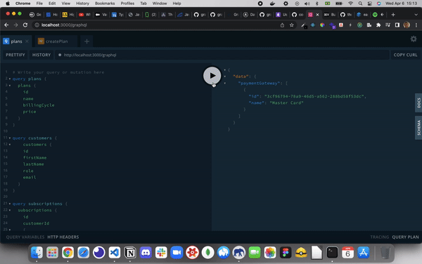
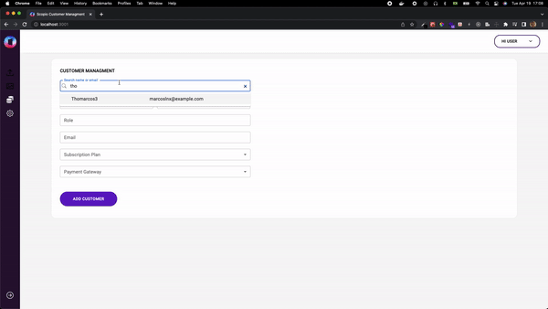

<h1 align="center">Full Stack Scopio Test</h1>

<span align="center">
  
</span>

<br />
<br />
<span align="center">
  
</span>

<br/>

[](https://github.com/thomaslnx)
[](https://github.com/thomaslnx)
[](https://github.com/thomaslnx)

<br/>
<br/>

<hr/>
<br/>


# 📝 About this challenge

<p>
  This project has the intention of the show of what are my coding skills for an open role for a software company. The challenge has two parts: the backend and the front end. The first already done is the backend. Right below I'll describe all technologies that I use to achieve this result.
</p>

<br/>

# ⚙️ Applied Technologies

# Backend

- NodeJS;
- ExpressJS;
- TypeScript;
- Docker;
- Docker Compose;
- MomentJS;
- ESlint;
- Prettier;
- Husky;
- PostgreSQL;
- Sequelize ORM;
- GraphQL;
- Apollo Server;

<br/>

# Frontend

- ReactJS;
- TypeScript;
- Apollo Client;
- Material UI;

<br />

# 🛠️ How to execute locally

```Backend```

***You'll need to have Docker installed into your system***

Then make the clone by following the link:
[Full Stack Marcos Challenge](https://github.com/edgareler/marcos-fullstack-test)

After you have cloned the repo install all the project's dependencies. Enter in frontend and backend folder and run the command:

```yarn``` or ```npm install```

Obs: case show up a message telling you that .git file was not found just run the command: ```git init````

To run the backend project enter inside backend folder and run the command: 
<br />
```yarn backend-docker``` or ```npm run backend-docker```

<br/>

To run frontend project run enter in frontend folder and run the command:
<br />
```yarn start``` or ```npm run start```

OBS: for the frontend project maybe be necessary to set API address to the your local environment. For this go to frontend folder -> src -> services -> api -> index.ts. In the uri apollo property put your local ip address.

🎉 🎉 🎉 Well, at this point your project is set up and running. So, you can access the server and can make the backend operations, go to your browser and type: http://localhost:3000/graphql.

The Docker and Docker Compose can be possible to contain all the backend application, including the database and some initial data.


If you like from my job you can find me:
<br/>
<br/>


