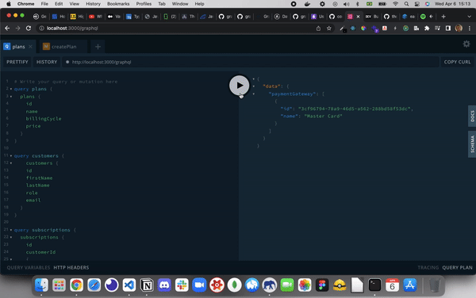

<h1 align="center">Full Stack Scopio Test</h1>

<span align="center">
  
</span>

<br/>

[](https://github.com/thomaslnx)
[](https://github.com/thomaslnx)
[](https://github.com/thomaslnx)

<br/>
<br/>

<hr/>
<br/>


# 📝 About this challenge

<p>
  This project has the intention of the show of what are my coding skills for an open role for a software company. The challenge has two parts: the backend and the front end. The first already done is the backend. Right below I'll describe all technologies that I use to achieve this result.
</p>

<br/>

# ⚙️ Applied Technologies

- NodeJS;
- ExpressJS;
- TypeScript;
- Docker;
- Docker Compose;
- MomentJS;
- ESlint;
- Prettier;
- Husky;
- PostgreSQL;
- Sequelize ORM;
- GraphQL;
- Apollo Server;

<br/>

# 🛠️ How to execute locally

***You'll need to have Docker installed into your system***

Then make the clone by following the link:
[Full Stack Marcos Challenge](https://github.com/edgareler/marcos-fullstack-test)

After you have cloned the repo install all the project's dependencies by running the command:

```yarn``` or ```npm install```
